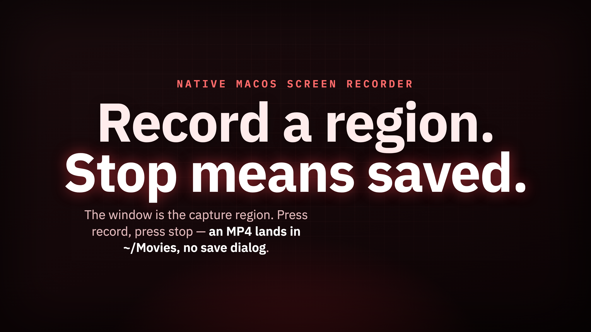

<!-- article:image-slot name="hero" -->
<picture>
  <source media="(prefers-color-scheme: dark)" srcset="docs/images/hero/image.png">
  <source media="(prefers-color-scheme: light)" srcset="docs/images/hero/image.png">
  
</picture>
<!-- /article:image-slot -->

Most days I just want to capture one rectangle of my screen and hand the file to someone. OBS does that, and it does a hundred other things too, which is exactly the cost: every time I opened it the extra setup got between me and the one thing I came to do. Small interruptions, repeated all day, were enough to make me record less than I wanted to. So I built Recordy, a small native macOS screen recorder scoped to a region. The window is the capture region: position it over what you want, press record, press stop, and an MP4 is saved automatically.

## What It Does

Recordy records a chosen region of your screen with three knobs and nothing else: frames per second, a quality profile, and whether system audio is captured. Those settings exist because they change the output in ways I care about day to day. It is deliberately narrow, a tool for grabbing part of the screen quickly, not a streaming suite or a production studio.

## Install

The fastest way to get Recordy is Homebrew, via a small tap that builds it from source on your machine:

```bash
brew tap rbmrs/recordy
brew install rbmrs/recordy/recordy
```

Building from source locally, rather than shipping a prebuilt signed binary, is deliberate: there's no $99/year Apple Developer Program membership behind this project, so nothing is signed or notarized. Compiling on your machine sidesteps Gatekeeper's "unidentified developer" dialog entirely — that check only fires on binaries quarantined by a browser, Mail, or AirDrop-style download, not on something `git`, `curl`, or Homebrew's fetcher pulled down and built locally. `recordy` lands on your `PATH` automatically once the formula finishes.

If you'd rather build it yourself without Homebrew, Recordy is a plain Swift Package Manager executable targeting macOS 14 and later:

```bash
git clone https://github.com/rbmrs/recordy.git
cd recordy
swift build -c release
swift run recordy
```

### Screen Recording Permission

Recordy captures through ScreenCaptureKit, which macOS gates behind the system Screen Recording permission. The first time you try to record, macOS prompts you to grant access under System Settings, Privacy and Security, Screen Recording. Until that is granted, the system hands no screen content to the app, so it is a one-time step before your first capture.

## Usage

Launch Recordy and you get a single window that doubles as the recording region. The record button sits at the top of that window, so starting a capture is a matter of pressing it. Press stop and the recording is written automatically as an MP4 to `~/Movies/Recordy/`, named with the date and time of the capture. There is no save dialog and no export step: stop means saved.

Before you record, set the three knobs to taste:

- **FPS:** how many frames per second to capture.
- **Quality:** a profile that trades file size against fidelity.
- **Audio:** system audio capture on or off.

## How It Works: The Window Is The Region

The feature that makes Recordy feel different is that the recording tool behaves like a window you look through. Position the app window over any application you want to record, and the portion of the screen being captured stays visible underneath it for the whole session. You can see exactly what is inside the frame while you record, and you can click through the window to interact with the app beneath it.

That collapses "define the region" and "see the region" into one object. Instead of drawing a rectangle on a dimmed overlay and then losing track of where it was, you move the Recordy window over the thing you want and what shows through it is what gets recorded. There is no separate step to confirm the choice: where you place the window and how you size it is the capture setup.

<!-- article:image-slot name="body-1" placeholder -->
<!-- ADD AN IMAGE, either way:
     A) Drop any image file into  docs/images/1/  (any filename), then re-run the skill.
     B) GitHub web editor: delete the  line below, click the empty line, paste a screenshot. -->

<!-- /article:image-slot -->

Around that idea the controls stay minimal. The record button is the most prominent element because starting a recording is the most common thing you do; everything else is the small set of dropdowns and toggles for FPS, quality, and audio. No mode switching, no scenes, no layering.

## Quality Profiles And File Size

The quality profiles are the setting I reach for most, because most of the time the recording is going straight to a friend or colleague over chat or email, and I do not want to send a large file. A screen recording at full fidelity is heavier than it needs to be for "here, watch this." A profile lets me step the quality down a little, which makes the file noticeably easier to download. Having it as a dropdown means I make that call up front instead of re-encoding later. There are also subtle adjustments under the hood so everything functions seamlessly, but they are not knobs I expose, because the point is that you should not have to think about them.

## Why I Built It This Way

I built Recordy for myself, and the surprise has been how much more I use it than I expected. FPS, quality, and system audio were not chosen to be a complete feature set; they are the things I actually adjusted, which is a more honest list than the one I would have written down trying to anticipate every use.

<!-- article:image-slot name="body-2" -->

<!-- /article:image-slot -->

It is still a work in progress, and I refine it incrementally. The bar for adding anything is that it must not erode the one or two click path that made the tool worth building. One thing I might add later is a switch to toggle the microphone on or off, which fits the existing shape: another small toggle next to the ones already there, not a new mode.

## When To Use It, And When Not To

Reach for Recordy when:

- You are on macOS and want a screen recorder scoped to a region of the screen.
- You want to see the exact area you are capturing while you record, and click through it to the app underneath.
- You want to start and stop with a button and have the file saved automatically to a default folder.
- You want to trade a little quality for a smaller, easier-to-share file.

It may not fit when:

- You need the breadth of a full recording suite with scenes, layering, and streaming.
- You are not on macOS. Recordy is currently built exclusively for Mac.

If you find Recordy useful and want it tailored to another system such as Windows or Linux, reach out through the project's GitHub page. I am open to expanding its compatibility if there is encouragement to do so.

## Built with Claude Code

This tool was designed, written, and iterated on with [Claude Code](https://claude.com/claude-code) as the primary author.

<!-- article:v1 -->
